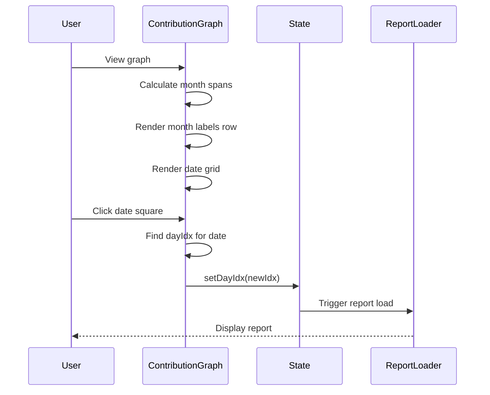
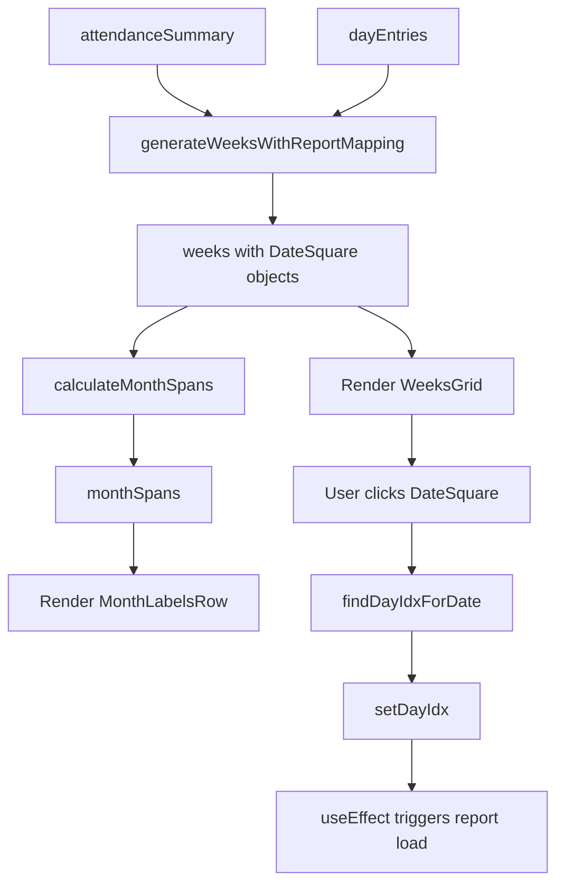

# Design Document: Refactor Contribution Graph - Clickable

## Overview

Refactor the attendance contribution graph in app/page.tsx to separate month labels from the grid, enable date selection for viewing reports, and remove the redundant DATE STRIP component. The new design will display month labels in a separate row above the grid, pack date squares tightly with consistent spacing, make dates with reports clickable to navigate to that day's report, and provide visual feedback for selected and available dates.

## Main Algorithm/Workflow



## Core Interfaces/Types

```typescript
interface DayEntry {
  date: string;        // YYYY-MM-DD format
  daily_id: string;
  report_id: string | null;
}

interface AttendanceSummary {
  date: string;        // YYYY-MM-DD format
  status: 'present' | 'absent' | 'sick' | 'leave';
}

interface DateSquare {
  date: Date;
  dateStr: string;     // YYYY-MM-DD format
  status: string | null;
  hasReport: boolean;
  dayIdx: number | null;  // Index in dayEntries array, null if no report
}

interface WeekColumn {
  days: DateSquare[];
  monthLabel: string;  // Empty string if not first week of month
}

interface MonthSpan {
  label: string;       // e.g., "ม.ค.", "ก.พ."
  startWeekIdx: number;
  weekCount: number;
}
```

## Key Functions with Formal Specifications

### Function 1: calculateMonthSpans()

```typescript
function calculateMonthSpans(weeks: WeekColumn[]): MonthSpan[]
```

**Preconditions:**
- `weeks` is a non-empty array of WeekColumn objects
- Each week contains 7 days (Sunday to Saturday)
- Days are in chronological order

**Postconditions:**
- Returns array of MonthSpan objects
- Each month appears exactly once
- Month spans are in chronological order
- Sum of all weekCount values equals weeks.length
- No gaps or overlaps in week coverage

**Loop Invariants:**
- All processed weeks have been assigned to exactly one month
- Month spans are in chronological order
- Current week index matches sum of previous month spans

### Function 2: findDayIdxForDate()

```typescript
function findDayIdxForDate(dateStr: string, dayEntries: DayEntry[]): number | null
```

**Preconditions:**
- `dateStr` is in YYYY-MM-DD format
- `dayEntries` is an array (may be empty)
- dayEntries dates are in YYYY-MM-DD format

**Postconditions:**
- Returns index if date found in dayEntries
- Returns null if date not found
- Return value is valid index (0 <= idx < dayEntries.length) or null
- If multiple entries have same date, returns first occurrence

**Loop Invariants:** N/A (uses Array.findIndex)

### Function 3: handleDateClick()

```typescript
function handleDateClick(dateSquare: DateSquare): void
```

**Preconditions:**
- `dateSquare` is a valid DateSquare object
- `dateSquare.hasReport` is true (enforced by UI disabled state)
- `dateSquare.dayIdx` is not null

**Postconditions:**
- `dayIdx` state is updated to dateSquare.dayIdx
- Report loading is triggered via useEffect
- Selected date square shows blue border
- Previously selected date square loses blue border

**Loop Invariants:** N/A (single state update)

### Function 4: generateWeeksWithReportMapping()

```typescript
function generateWeeksWithReportMapping(
  attendanceSummary: AttendanceSummary[],
  dayEntries: DayEntry[]
): WeekColumn[]
```

**Preconditions:**
- `attendanceSummary` is an array (may be empty)
- `dayEntries` is an array (may be empty)
- All dates are in YYYY-MM-DD format
- attendanceSummary dates are in chronological order

**Postconditions:**
- Returns array of WeekColumn objects
- Each week contains exactly 7 days (Sunday to Saturday)
- First week starts on Sunday before or equal to first attendance date
- Last week ends on Saturday after or equal to last attendance date
- Each DateSquare has correct hasReport and dayIdx values
- DateSquares with hasReport=true have valid dayIdx (0 <= idx < dayEntries.length)

**Loop Invariants:**
- All generated days are in chronological order
- Each week starts on Sunday (day 0)
- Current date is always >= previous date

## Algorithmic Pseudocode

### Main Rendering Algorithm

```typescript
// ALGORITHM: Render Contribution Graph with Clickable Dates
// INPUT: attendanceSummary, dayEntries, currentDayIdx
// OUTPUT: React component rendering

BEGIN
  // Step 1: Generate weeks with report mapping
  weeks ← generateWeeksWithReportMapping(attendanceSummary, dayEntries)
  
  // Step 2: Calculate month spans for header row
  monthSpans ← calculateMonthSpans(weeks)
  
  // Step 3: Render month labels row
  RENDER MonthLabelsRow:
    FOR each monthSpan IN monthSpans DO
      RENDER month label spanning monthSpan.weekCount columns
    END FOR
  
  // Step 4: Render day labels column (อา, จ, อ, ...)
  RENDER DayLabelsColumn
  
  // Step 5: Render date grid
  FOR each week IN weeks DO
    RENDER WeekColumn:
      FOR each day IN week.days DO
        isSelected ← (day.dayIdx = currentDayIdx)
        isClickable ← day.hasReport
        
        RENDER DateSquare:
          style ← {
            background: getStatusColor(day.status),
            opacity: isClickable ? 1.0 : 0.5,
            border: isSelected ? "2px solid #6366f1" : "none",
            cursor: isClickable ? "pointer" : "default"
          }
          
          IF isClickable THEN
            onClick ← () => handleDateClick(day)
          ELSE
            disabled ← true
          END IF
      END FOR
  END FOR
END
```

**Preconditions:**
- attendanceSummary and dayEntries are loaded
- React state (dayIdx, setDayIdx) is available
- Component is mounted

**Postconditions:**
- Month labels displayed in separate row above grid
- All date squares rendered with correct styling
- Clickable dates respond to clicks
- Selected date has blue border
- Non-clickable dates are semi-transparent

**Loop Invariants:**
- All rendered weeks maintain chronological order
- Each week column contains exactly 7 day squares
- Month label spans match actual week distribution

### Date-to-Index Mapping Algorithm

```typescript
// ALGORITHM: Find dayIdx for clicked date
// INPUT: clickedDateStr (YYYY-MM-DD), dayEntries array
// OUTPUT: dayIdx (number) or null

BEGIN
  // Linear search through dayEntries
  FOR i ← 0 TO dayEntries.length - 1 DO
    IF dayEntries[i].date = clickedDateStr THEN
      RETURN i
    END IF
  END FOR
  
  // Date not found in dayEntries
  RETURN null
END
```

**Preconditions:**
- clickedDateStr is valid YYYY-MM-DD format
- dayEntries is an array (may be empty)

**Postconditions:**
- Returns valid index if date exists in dayEntries
- Returns null if date not found
- No side effects

**Loop Invariants:**
- All entries from 0 to i-1 have been checked and don't match
- i is always a valid index (0 <= i < dayEntries.length)

### Month Span Calculation Algorithm

```typescript
// ALGORITHM: Calculate month spans for header
// INPUT: weeks array (WeekColumn[])
// OUTPUT: monthSpans array (MonthSpan[])

BEGIN
  monthSpans ← []
  currentMonth ← null
  currentSpan ← null
  
  FOR weekIdx ← 0 TO weeks.length - 1 DO
    week ← weeks[weekIdx]
    firstDayOfWeek ← week.days[0]
    month ← getMonth(firstDayOfWeek.date)
    
    IF month ≠ currentMonth THEN
      // New month started
      IF currentSpan ≠ null THEN
        // Save previous month span
        monthSpans.push(currentSpan)
      END IF
      
      // Start new month span
      currentMonth ← month
      currentSpan ← {
        label: formatMonthLabel(month),
        startWeekIdx: weekIdx,
        weekCount: 1
      }
    ELSE
      // Same month continues
      currentSpan.weekCount ← currentSpan.weekCount + 1
    END IF
  END FOR
  
  // Add final month span
  IF currentSpan ≠ null THEN
    monthSpans.push(currentSpan)
  END IF
  
  RETURN monthSpans
END
```

**Preconditions:**
- weeks is non-empty array
- Each week has at least one day
- Weeks are in chronological order

**Postconditions:**
- All weeks are covered by exactly one month span
- Month spans are in chronological order
- No gaps or overlaps

**Loop Invariants:**
- All weeks from 0 to weekIdx-1 are assigned to month spans
- currentSpan represents the ongoing month being processed
- Sum of all completed monthSpans.weekCount + currentSpan.weekCount = weekIdx

## Example Usage

```typescript
// Example 1: Rendering the contribution graph
<ContributionGraph
  attendanceSummary={attendanceSummary}
  dayEntries={dayEntries}
  currentDayIdx={dayIdx}
  onDateClick={(newIdx) => setDayIdx(newIdx)}
/>

// Example 2: Handling date click
const handleDateClick = (dateSquare: DateSquare) => {
  if (dateSquare.hasReport && dateSquare.dayIdx !== null) {
    setDayIdx(dateSquare.dayIdx);
    // useEffect will trigger report loading
  }
};

// Example 3: Styling selected date
const getDateSquareStyle = (day: DateSquare, currentDayIdx: number) => ({
  width: 10,
  height: 10,
  borderRadius: 2,
  background: getStatusColor(day.status),
  opacity: day.hasReport ? 1.0 : 0.5,
  border: day.dayIdx === currentDayIdx ? '2px solid #6366f1' : 'none',
  cursor: day.hasReport ? 'pointer' : 'default',
  transition: 'all .15s'
});

// Example 4: Month label rendering
const renderMonthLabels = (monthSpans: MonthSpan[]) => (
  <div style={{display: 'flex', gap: 3}}>
    {monthSpans.map((span, idx) => (
      <div
        key={idx}
        style={{
          width: `calc(${span.weekCount} * 13px)`, // 10px square + 3px gap
          fontSize: '0.6rem',
          color: '#64748b',
          fontWeight: 600,
          textAlign: 'center'
        }}
      >
        {span.label}
      </div>
    ))}
  </div>
);
```

## Correctness Properties

### Property 1: Date-to-Index Mapping Correctness
```typescript
// For all dates in dayEntries, clicking that date square sets dayIdx correctly
∀ entry ∈ dayEntries:
  ∃ dateSquare ∈ allDateSquares:
    dateSquare.dateStr = entry.date ∧
    dateSquare.dayIdx = indexOf(entry, dayEntries) ∧
    onClick(dateSquare) ⟹ dayIdx = dateSquare.dayIdx
```

### Property 2: Month Label Coverage
```typescript
// All weeks are covered by exactly one month label
∀ week ∈ weeks:
  ∃! monthSpan ∈ monthSpans:
    monthSpan.startWeekIdx ≤ indexOf(week, weeks) <
    monthSpan.startWeekIdx + monthSpan.weekCount
```

### Property 3: Visual Feedback Consistency
```typescript
// Selected date always has blue border, others don't
∀ dateSquare ∈ allDateSquares:
  (dateSquare.dayIdx = currentDayIdx) ⟺
  (dateSquare.style.border = "2px solid #6366f1")
```

### Property 4: Clickability Constraint
```typescript
// Only dates with reports are clickable
∀ dateSquare ∈ allDateSquares:
  dateSquare.hasReport ⟺ (dateSquare.onClick ≠ null ∧ dateSquare.opacity = 1.0)
```

### Property 5: Grid Spacing Uniformity
```typescript
// All date squares have consistent gap regardless of month boundaries
∀ i ∈ [0, weeks.length - 2]:
  gap(weeks[i], weeks[i+1]) = 3px
```

## Component Structure

### ContributionGraph Component Hierarchy

```
ContributionGraph
├── MonthLabelsRow
│   └── MonthLabel (repeated for each month span)
├── GridContainer
│   ├── DayLabelsColumn
│   │   └── DayLabel × 7 (อา, จ, อ, พ, พฤ, ศ, ส)
│   └── WeeksGrid
│       └── WeekColumn (repeated for each week)
│           └── DateSquare × 7 (one per day)
```

### Component Responsibilities

**ContributionGraph**:
- Fetch and manage attendanceSummary and dayEntries
- Calculate weeks and month spans
- Handle date selection state
- Coordinate between child components

**MonthLabelsRow**:
- Render month labels with correct spans
- Align labels with week columns below

**DayLabelsColumn**:
- Render day-of-week labels (อา, จ, อ, ...)
- Maintain vertical alignment with date squares

**WeekColumn**:
- Render 7 date squares for one week
- Maintain consistent spacing

**DateSquare**:
- Display single date with status color
- Handle click events
- Show visual feedback (selected border, hover effects)
- Disable interaction for dates without reports

## Data Flow



## Error Handling

### Error Scenario 1: Empty Data Arrays

**Condition**: attendanceSummary or dayEntries is empty
**Response**: Display empty state message or hide contribution graph
**Recovery**: Graph appears when data is loaded

### Error Scenario 2: Date Format Mismatch

**Condition**: Date string not in YYYY-MM-DD format
**Response**: Log warning, skip invalid date
**Recovery**: Continue processing valid dates

### Error Scenario 3: Invalid dayIdx Click

**Condition**: User somehow clicks date with null dayIdx
**Response**: Ignore click, no state change
**Recovery**: No action needed, UI should prevent this

### Error Scenario 4: Missing Report Data

**Condition**: dayEntries has date but no report_id
**Response**: Show date square as semi-transparent, disabled
**Recovery**: Date becomes clickable when report is added

## Testing Strategy

### Unit Testing Approach

**Test calculateMonthSpans()**:
- Single month spanning multiple weeks
- Month boundary in middle of week
- Multiple months with varying week counts
- Edge case: single week

**Test findDayIdxForDate()**:
- Date exists in dayEntries (first, middle, last position)
- Date not in dayEntries
- Empty dayEntries array
- Multiple entries with same date (should return first)

**Test generateWeeksWithReportMapping()**:
- Empty attendanceSummary
- Single week of data
- Multiple months of data
- Dates with and without reports
- Verify hasReport and dayIdx correctness

**Test handleDateClick()**:
- Click date with report (should update dayIdx)
- Click date without report (should be disabled)
- Click already selected date (should remain selected)

### Property-Based Testing Approach

**Property Test Library**: fast-check (for TypeScript/JavaScript)

**Property 1: Month spans cover all weeks**
```typescript
// Generate arbitrary weeks array
// Verify: sum of all monthSpan.weekCount = weeks.length
fc.assert(
  fc.property(fc.array(fc.weekColumn()), (weeks) => {
    const spans = calculateMonthSpans(weeks);
    const totalWeeks = spans.reduce((sum, s) => sum + s.weekCount, 0);
    return totalWeeks === weeks.length;
  })
);
```

**Property 2: Date mapping is bijective for dates with reports**
```typescript
// For all dates in dayEntries, there exists exactly one DateSquare with that date
fc.assert(
  fc.property(fc.dayEntriesArray(), (dayEntries) => {
    const weeks = generateWeeksWithReportMapping([], dayEntries);
    const allSquares = weeks.flatMap(w => w.days);
    
    return dayEntries.every(entry => {
      const matchingSquares = allSquares.filter(sq => sq.dateStr === entry.date);
      return matchingSquares.length === 1 && matchingSquares[0].hasReport;
    });
  })
);
```

**Property 3: Selected date always has blue border**
```typescript
// Render with different dayIdx values, verify only that date has border
fc.assert(
  fc.property(fc.nat(), fc.dayEntriesArray(), (dayIdx, dayEntries) => {
    const weeks = generateWeeksWithReportMapping([], dayEntries);
    const allSquares = weeks.flatMap(w => w.days);
    
    const selectedSquares = allSquares.filter(sq => sq.dayIdx === dayIdx);
    return selectedSquares.every(sq => hasBlueBorder(sq));
  })
);
```

### Integration Testing Approach

**Test 1: Full user flow**
- Load component with data
- Verify graph renders correctly
- Click date square
- Verify dayIdx updates
- Verify report loads

**Test 2: State synchronization**
- Change childId
- Verify graph updates with new data
- Verify selected date resets or updates appropriately

**Test 3: Visual regression**
- Capture screenshots of graph with various data
- Compare against baseline images
- Verify month labels, spacing, colors

## Performance Considerations

**Optimization 1: Memoize week generation**
- Use React.useMemo for generateWeeksWithReportMapping
- Dependencies: attendanceSummary, dayEntries
- Prevents recalculation on unrelated re-renders

**Optimization 2: Memoize month spans**
- Use React.useMemo for calculateMonthSpans
- Dependency: weeks array
- Cheap calculation but called on every render

**Optimization 3: Virtualization (future)**
- If date range exceeds 52 weeks, consider virtualization
- Current implementation handles up to 1 year efficiently

**Optimization 4: Event handler stability**
- Use React.useCallback for handleDateClick
- Prevents unnecessary re-renders of DateSquare components

## Security Considerations

**Input Validation**:
- Validate date strings match YYYY-MM-DD format
- Sanitize dayIdx to ensure it's within bounds
- Prevent XSS in month labels (use React's built-in escaping)

**State Integrity**:
- Ensure dayIdx is always valid index or null
- Prevent race conditions when loading reports
- Handle concurrent state updates gracefully

## Dependencies

**React**: Core framework (already in project)
**TypeScript**: Type safety (already in project)
**Mermaid**: Diagrams in documentation (optional, for docs only)
**fast-check**: Property-based testing library (to be added for testing)

**No new runtime dependencies required** - refactoring uses existing React patterns and state management.
